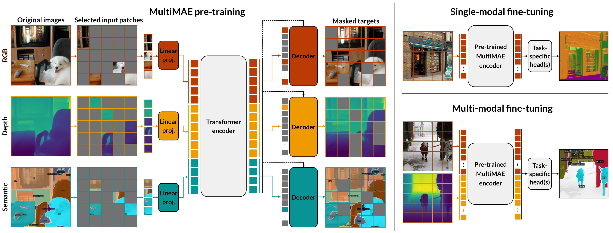

# MultiMAE: Multi-modal Multi-task Masked Autoencoders

[Roman Bachmann*](https://roman-bachmann.github.io/), [David Mizrahi*](https://dmizrahi.com), [Andrei Atanov](https://andrewatanov.github.io/), [Amir Zamir](https://vilab.epfl.ch/zamir/)


 [`Website`](https://multimae.epfl.ch) | [`arXiv`](https://arxiv.org/abs/2204.01678) | [`BibTeX`](#citation)

[](https://colab.research.google.com/github/EPFL-VILAB/MultiMAE/blob/main/MultiMAE_Demo.ipynb)  [](https://huggingface.co/spaces/EPFL-VILAB/MultiMAE)


Official PyTorch implementation and pre-trained models for MultiMAE: Multi-modal Multi-task Masked Autoencoders.


<p align="center">

</p>

We introduce Multi-modal Multi-task Masked Autoencoders (**MultiMAE**), an efficient and effective pre-training strategy for Vision Transformers. 
Given a small random sample of visible patches from multiple modalities, the MultiMAE pre-training objective is to reconstruct the masked-out regions. 
Once pre-trained, a single MultiMAE encoder can then be used for both single-modal and multi-modal downstream transfer, yielding competitive to or significantly better results than the baselines.

## Catalog
- [x] Pre-trained models
- [x] MultiMAE pre-training code
- [x] ImageNet-1K classification fine-tuning code
- [x] Semantic segmentation fine-tuning code (single-modal & multi-modal)
- [x] Depth estimation fine-tuning code
- [x] Taskonomy fine-tuning code
- [x] Colab & Hugging Face demos
- [x] Download links for ImageNet-1K depth and semantic segmentation pseudo labels

## Pre-trained models

We provide the weights of our pre-trained MultiMAE ViT-B model, in MultiViT (multi-modal) format and [timm](https://github.com/rwightman/pytorch-image-models/tree/master/timm) (RGB-only) format. 

For comparison, we also provide the weights of a MAE ViT-B model that we pre-trained using the [official MAE codebase](https://github.com/facebookresearch/mae) following the recommended settings.

| Method   	     | Arch. 	 | Pre-training<br>modalities 	 | Pre-training<br>epochs 	 | Weights<br>(MultiViT) 	     | Weights<br>(timm) 	     | Config  	                                                                  |
|----------------|---------|------------------------------|--------------------------|-----------------------------|-------------------------|----------------------------------------------------------------------------|
| MAE      	     | ViT-B 	 | RGB                        	 | 1600                   	 | [download](https://github.com/EPFL-VILAB/MultiMAE/releases/download/pretrained-weights/mae-b_dec512d8b_1600e_multivit-c477195b.pth)                  	 | [download](https://github.com/EPFL-VILAB/MultiMAE/releases/download/pretrained-weights/mae-b_dec512d8b_1600e_timm-f74f3a8d.pth)              	 | See [MAE](https://github.com/facebookresearch/mae/blob/main/PRETRAIN.md) 	 |
| **MultiMAE** 	 | ViT-B 	 | RGB+D+S                    	 | 1600                   	 | [**download**](https://github.com/EPFL-VILAB/MultiMAE/releases/download/pretrained-weights/multimae-b_98_rgb+-depth-semseg_1600e_multivit-afff3f8c.pth)                  	 | [**download**](https://github.com/EPFL-VILAB/MultiMAE/releases/download/pretrained-weights/multimae-b_98_rgb+-depth-semseg_1600e_timm-bafa5499.pth)             	 | [link](cfgs/pretrain/multimae-b_98_rgb+-depth-semseg_1600e.yaml) 	         |

These pre-trained models can then be fine-tuned using this codebase to reach the following performance:


<table>
<thead>
  <tr>
    <th>Method</th>
    <th>Classif. (@1)</th>
    <th colspan="7">Semantic Segmentation (mIoU)</th>
    <th>Depth (δ1)</th>
  </tr>
</thead>
<tbody>
  <tr>
    <td></td>
    <td align="center"> ImageNet-1K<br>(RGB)<br></td>
    <td align="center">ADE20K<br>(RGB)<br></td>
    <td align="center" colspan="3">Hypersim<br>(RGB / D / RGB + D)<br></td>
    <td align="center"colspan="3">NYUv2<br>(RGB / D / RGB + D)<br></td>
    <td align="center">NYUv2<br>(RGB)<br></td>
  </tr>
  <tr>
    <td>Sup. (DeiT)</td>
    <td align="center">81.8</td>
    <td align="center">45.8</td>
    <td align="center">33.9</td>
    <td align="center">-</td>
    <td align="center">-</td>
    <td align="center">50.1</td>
    <td align="center">-</td>
    <td align="center">-</td>
    <td align="center">80.7</td>
  </tr>
  <tr>
    <td>MAE</td>
    <td align="center"><b>83.3</b></td>
    <td align="center"><b>46.2</b></td>
    <td align="center">36.5</td>
    <td align="center">-</td>
    <td align="center">-<br></td>
    <td align="center">50.8</td>
    <td align="center">-</td>
    <td align="center">-</td>
    <td align="center">85.1</td>
  </tr>
  <tr>
    <td><b>MultiMAE</b></td>
    <td align="center"><b>83.3</b></td>
    <td align="center"><b>46.2</b></td>
    <td align="center"><b>37.0</b></td>
    <td align="center"><b>38.5</b></td>
    <td align="center"><b>47.6</b></td>
    <td align="center"><b>52.0</b></td>
    <td align="center"><b>41.4</b></td>
    <td align="center"><b>56.0</b></td>
    <td align="center"><b>86.4</b></td>
  </tr>
</tbody>
</table>

### Model formats

We provide pre-trained weights in two different formats: the single-modal ViT / timm format, which is compatible with other popular ViT repositories (e.g., [timm](https://github.com/rwightman/pytorch-image-models/tree/master/timm), [DINO](https://github.com/facebookresearch/dino
), [MAE](https://github.com/facebookresearch/mae)), and the multi-modal MultiMAE / MultiViT format, which is used throughout this codebase for multi-modal pre-training and fine-tuning. See [`multimae/multimae.py`](multimae/multimae.py) for the documentation and implementation of MultiMAE / MultiViT.

You can convert between these formats using the provided [`vit2multimae_converter.py`](tools/vit2multimae_converter.py) and [`multimae2vit_converter.py`](tools/multimae2vit_converter.py) scripts.

## Usage

### Set-up

See [SETUP.md](SETUP.md) for set-up instructions.

### Pre-training

See [PRETRAINING.md](PRETRAINING.md) for pre-training instructions.

### Fine-tuning

See [FINETUNING.md](FINETUNING.md) for fine-tuning instructions.

## Demo & visualizations

For interactive demos, please see our [`website`](https://multimae.epfl.ch). Open our [`Colab notebook`](https://colab.research.google.com/github/EPFL-VILAB/MultiMAE/blob/main/MultiMAE_Demo.ipynb) to play around with the visualization code, or simply upload an image to our [`Hugging Face Spaces demo`](https://huggingface.co/spaces/EPFL-VILAB/MultiMAE).


## Acknowledgement

This repository is built using the [timm](https://github.com/rwightman/pytorch-image-models/tree/master/timm), [DeiT](https://github.com/facebookresearch/deit), [DINO](https://github.com/facebookresearch/dino
), [MoCo v3](https://github.com/facebookresearch/moco-v3), [BEiT](https://github.com/microsoft/unilm/tree/master/beit), [MAE-priv](https://github.com/BUPT-PRIV/MAE-priv), and [MAE](https://github.com/facebookresearch/mae) repositories.

## License

This project is under the CC-BY-NC 4.0 license. See [LICENSE](LICENSE) for details.

## Citation

If you find this repository helpful, please consider citing our work:

```BibTeX
@article{bachmann2022multimae,
  author    = {Roman Bachmann and David Mizrahi and Andrei Atanov and Amir Zamir},
  title     = {{MultiMAE}: Multi-modal Multi-task Masked Autoencoders},
  booktitle = {European Conference on Computer Vision},
  year      = {2022},
}
```
